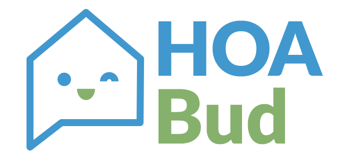

HOA Bud is a platform for HOA property managers to create AI-backed customer service agents tailored to their properties.

## Overview

HOA Bud allows property managers to manage multiple properties, upload governing documents (bylaws, FAQs) for AI indexing, store resident information to personalize interactions by name, and provide phone/text interfaces for residents to get quick answers or escalate issues. Property managers can also chat with the AI assistant within the platform.

## Features

- Manage multiple HOA properties in a single dashboard  
- Upload governing documents (bylaws, FAQs) and automatically index them for AI queries
- Store resident information (names, unit numbers) to personalize conversations
- AI-powered chat interface for property managers within the platform
- SMS/Voice support via Twilio for natural language queries by phone or text  
- In-app chat for property managers to interact with the AI assistant  
- Authentication and subscription management with Supabase Auth and Stripe  

## Tech Stack

- Front-End: Next.js deployed on Vercel  
- Back-End: FastAPI deployed on Vercel Serverless  
- Database & Auth: Supabase (Postgres, Auth, Storage)  
- Embeddings: pgvector extension in Supabase  
- AI Model: OpenAI GPT  
- SMS/Voice: Twilio  
- Billing: Stripe  

## Getting Started

1. Clone the repository  
2. Install dependencies for `frontend` and `api` directories  
3. Set environment variables (Supabase URL/KEY, OpenAI API KEY, Twilio keys, Stripe keys)  
4. Run Supabase migrations and start local development servers  

## Roadmap

See [`Roadmap.md`](Roadmap.md) for the detailed development plan.

## License

TBD – select a license appropriate for commercial use.
