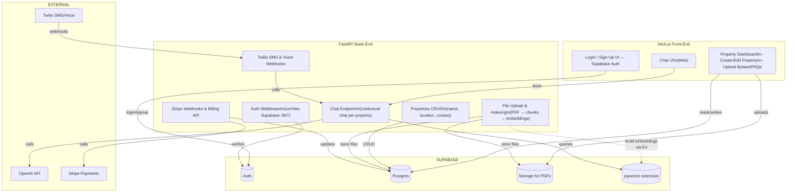

# Roadmap

This document outlines the MVP plan and phases for HOA Bud.

## Architecture Overview

## Phases

### 1. Project Setup & Core Data Models
- Initialize Supabase project:
  - tables: users via Auth, properties, documents, faqs, residents, twilio_numbers
  - enable pgvector extension for embeddings.
- Configure local development environment.

### 2. Authentication & Front-End
- Integrate Supabase Auth in Next.js (`_app.js`).
- Build login/sign-up pages and protect routes.
- Create Property Dashboard UI (list/create/edit).

### 3. Document Upload & Embedding
- Extend `/upload` endpoint to accept `property_id`.
- Store PDFs in Supabase Storage.
- FastAPI:
  - load PDFs → split into chunks.
  - generate embeddings with EmbeddingModel.
  - upsert into Postgres+pgvector.

### 4. Web Chat MVP
- Modify chat endpoint to require `property_id` and Supabase JWT.
- On each request:
  - fetch top-k chunks for property.
  - prepend as system prompt.
  - call OpenAI.
- Front-end:
  - add property selector.
  - pass `property_id` in `/chat` requests.

### 5. Deploy to Vercel
- Frontend: deploy Next.js on Vercel.
- Backend: deploy FastAPI as Vercel Serverless functions.
- Configure environment variables:
  - Supabase URL/Key, OpenAI Key, Stripe & Twilio creds.

### 6. Twilio SMS & Voice Integration
- Purchase/assign Twilio numbers per property; store in `twilio_numbers`.
- Expose `/twilio/sms` and `/twilio/voice` webhooks in FastAPI:
  - SMS: lookup property by number; call chat logic; respond via TwiML.
  - Voice: convert speech-to-text (or DTMF); call chat logic; respond via TwiML `<Say>`.
- Configure Twilio Console webhooks.

### 7. Stripe Billing
- Integrate Stripe Billing with Supabase:
  - Next.js: “Upgrade” page & Stripe Checkout.
  - FastAPI: handle Stripe webhooks; update subscription status in Supabase.
- Implement feature gates based on subscription (e.g., property limits).

### 8. Resident & FAQ Management (Stretch)
- Build UI/API for managers to add structured FAQs and resident records.
- Include these data as additional context in chat prompts.

### 9. Monitoring & Logging
- Add error monitoring (e.g., Sentry) for production.
- Log chat usage & costs per property.

---